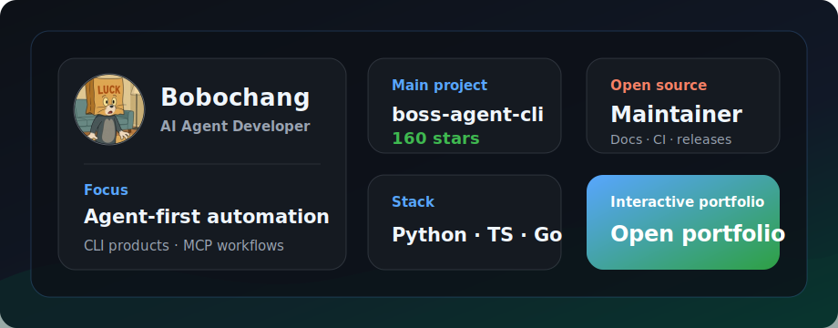
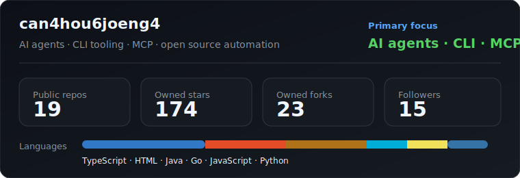

# Hi, I'm Bobochang

**AI Agent Developer** | **Full Stack Engineer** | **Open Source Maintainer**

I build agent-first automation tools, CLI products, and practical developer workflows that turn repeated work into reliable systems.

---

## Focus

- Building [boss-agent-cli](https://github.com/can4hou6joeng4/boss-agent-cli), an AI-agent-first CLI for BOSS Zhipin job search, recruiter workflows, MCP tools, and resume optimization.
- Designing automation tools that preserve explicit contracts: reproducible commands, machine-readable output, safe dry runs, and clear failure modes.
- Shipping open-source projects with practical documentation, CI guardrails, issue templates, and maintainer workflows.
- Based in Guangzhou, China, and open to collaboration around AI agents, CLI tools, MCP, workflow automation, and developer tooling.

---

## Bento Snapshot

<table>
  <tr>
    <td width="50%">
      <h3>AI Agent Tooling</h3>
      
Designing CLIs and MCP-facing tools that agents can operate through explicit, reproducible command contracts.

    </td>
    <td width="50%">
      <h3>Workflow Automation</h3>
      
Turning repeated job-search, document, smoke-test, and release workflows into maintainable automation.

    </td>
  </tr>
  <tr>
    <td width="50%">
      <h3>Open Source Quality</h3>
      
Maintaining docs, templates, CI checks, release hygiene, and contributor paths for practical public projects.

    </td>
    <td width="50%">
      <h3>Full Stack Delivery</h3>
      
Building across Python, TypeScript, Go, Swift, Java, web frontends, desktop apps, and GitHub-native tooling.

    </td>
  </tr>
</table>

---

## Featured Projects

| Project | What it does | Stack | Stars |
| --- | --- | --- | ---: |
| [boss-agent-cli](https://github.com/can4hou6joeng4/boss-agent-cli) | AI-agent-first CLI for BOSS Zhipin job search, welfare filtering, recruiter workflows, MCP tools, and resume optimization. | Python, MCP, Patchright | 160 |
| [legal-extractor](https://github.com/can4hou6joeng4/legal-extractor) | Cross-platform legal document extraction tool for PDF/DOCX/OCR workflows. | Go, Wails, Vue | 4 |
| [interview-prep](https://github.com/can4hou6joeng4/interview-prep) | Open-source interview prep toolkit with GitHub Pages flashcards and a native iOS study app. | HTML, Swift, GitHub Pages | 1 |
| [daily-juejin-checkin](https://github.com/can4hou6joeng4/daily-juejin-checkin) | GitHub Actions automation for Juejin daily sign-in, lottery, and Telegram notifications. | JavaScript, GitHub Actions | 1 |

---

## What I Build For

- **Agent-native tooling**: CLIs and MCP-facing tools that are easy for humans and AI agents to operate.
- **Workflow automation**: repeatable scripts, smoke tests, structured status output, and production-minded defaults.
- **Developer experience**: clear command contracts, readable docs, small feedback loops, and GitHub-ready project packaging.
- **Applied full stack systems**: Python, TypeScript, Go, Swift, Java, web frontends, desktop apps, and CI/CD workflows.

---

## Portfolio Views

| Template | Link | Best for |
| --- | --- | --- |
| GitHub Style | [Open](https://checkmygit.com/can4hou6joeng4?template=github) | A familiar GitHub-like profile layout. |
| Bento | [Open](https://checkmygit.com/can4hou6joeng4?template=bento) | A visual portfolio view for quick scanning. |
| Minimal CV | [Open](https://checkmygit.com/can4hou6joeng4?template=minimal) | A compact resume-style profile. |

---

## Tech Stack

---

## GitHub Snapshot

---

## Open Source Footprint

- Maintainer of [boss-agent-cli](https://github.com/can4hou6joeng4/boss-agent-cli), currently focused on open-source quality, CLI contracts, smoke testing, and docs governance.
- Maintainer of [legal-extractor](https://github.com/can4hou6joeng4/legal-extractor), a legal-tech desktop app with extraction, OCR, release, and frontend test workflows.
- Contributor/listing participant in AI and MCP ecosystem collections such as [awesome-mcp-servers](https://github.com/punkpeye/awesome-mcp-servers), [awesome-agents](https://github.com/kyrolabs/awesome-agents), and [awesome-ai-tools](https://github.com/mahseema/awesome-ai-tools).

---

## Connect

